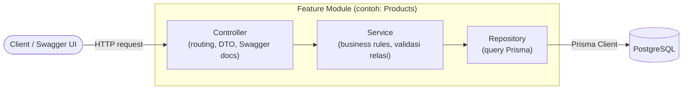
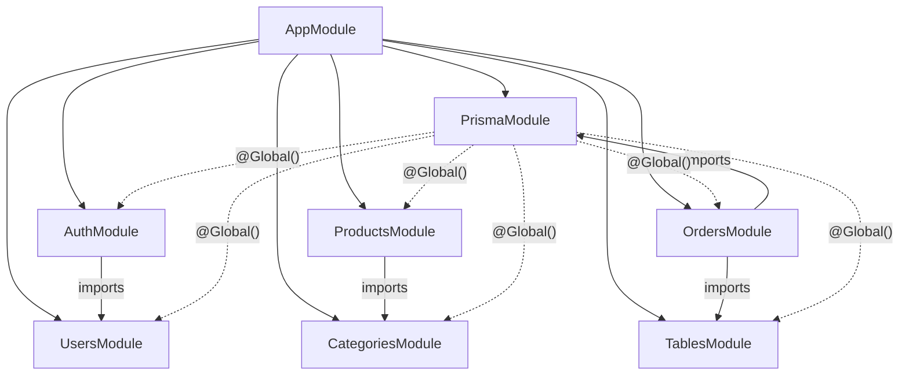

# Arsitektur Aplikasi

## Ringkasan

Food Ordering API dibangun dengan NestJS mengikuti pola layer klasik **Controller → Service → Repository**, dengan Prisma sebagai satu-satunya lapisan yang menyentuh database secara langsung.



- **Controller** — hanya bertugas menerima HTTP request, memvalidasi bentuk data lewat DTO (`class-validator`), lalu mendelegasikan ke Service. Juga tempat anotasi Swagger (`@ApiTags`, `@ApiOperation`, dst).
- **Service** — tempat business logic: cek duplikat, cek keberadaan relasi (mis. kategori harus ada sebelum produk dibuat), throw `NotFoundException` / `ConflictException` sesuai kondisi.
- **Repository** — satu-satunya lapisan yang memanggil `PrismaService`. Memisahkan query database dari business logic sehingga service tetap mudah diuji/di-mock.

Contoh nyata pola ini bisa dilihat di module `categories` dan `products`:

- [categories.controller.ts](../src/modules/categories/categories.controller.ts) → [categories.service.ts](../src/modules/categories/categories.service.ts) → [categories.repository.ts](../src/modules/categories/categories.repository.ts)
- [products.controller.ts](../src/modules/products/products.controller.ts) → [products.service.ts](../src/modules/products/products.service.ts) → [products.repository.ts](../src/modules/products/products.repository.ts)

## Module Graph



- `PrismaModule` ditandai `@Global()` ([prisma.module.ts](../src/database/prisma.module.ts)) sehingga `PrismaService` bisa langsung di-inject di repository module manapun tanpa perlu import ulang.
- `AuthModule` meng-import `UsersModule` untuk mengecek kredensial user saat login.
- `ProductsModule` meng-import `CategoriesModule` untuk memvalidasi `categoryId` saat membuat/mengubah produk.
- `OrdersModule` meng-import `PrismaModule` secara eksplisit ([orders.module.ts](../src/modules/orders/orders.module.ts)) karena `OrdersService` juga menyuntik `PrismaService` langsung untuk menjalankan transaksi lintas tabel.
- `OrdersModule` meng-import `TablesModule` agar `TablesRepository` bisa di-inject ke `OrdersService` untuk resolve `tableCode` → `tableId` saat membuat order (lihat [features/orders.md](features/orders.md#pengaitan-meja-tablecode)). `TablesModule` meng-`exports` `TablesService` dan `TablesRepository` ([tables.module.ts](../src/modules/tables/tables.module.ts)) untuk keperluan ini.

## Bootstrap & Global Providers

Semua konfigurasi global didaftarkan di [src/main.ts](../src/main.ts):

```ts
app.enableCors();
app.use(helmet());
app.setGlobalPrefix('api');
app.enableVersioning({ type: VersioningType.URI, defaultVersion: '1' });
app.useGlobalPipes(new ValidationPipe({ whitelist: true, transform: true, forbidNonWhitelisted: true }));
app.useGlobalInterceptors(new ResponseInterceptor());
app.useGlobalFilters(new HttpExceptionFilter());
setupSwagger(app);
```

| Provider | Fungsi |
| -------- | ------ |
| `helmet()` | Menambahkan HTTP security headers standar |
| `enableCors()` | Mengizinkan request cross-origin (default: semua origin) |
| `setGlobalPrefix('api')` | Semua route diawali `/api` |
| `enableVersioning` (URI, default `1`) | Semua route otomatis berada di `/api/v1/...` kecuali controller secara eksplisit memakai `VERSION_NEUTRAL` (dipakai health check di `AppController`) |
| `ValidationPipe` (`whitelist`, `transform`, `forbidNonWhitelisted`) | Body request divalidasi via `class-validator`; field yang tidak dikenal di DTO **ditolak** (400), field yang lolos otomatis di-transform ke tipe DTO |
| `ResponseInterceptor` | Membungkus setiap response sukses — lihat [Response Envelope](#response-envelope) |
| `HttpExceptionFilter` | Menstandarkan format error — lihat [Format Error](#format-error) |
| `setupSwagger(app)` | Menyalakan dokumentasi OpenAPI di `/docs` — lihat [swagger.config.ts](../src/config/swagger.config.ts) |

`LoggerMiddleware` ([logger.middleware.ts](../src/common/middleware/logger.middleware.ts)) didaftarkan di [app.module.ts](../src/app.module.ts) untuk semua route (`forRoutes('*')`) dan mencatat `METHOD URL STATUS - durasi(ms)` ke console setiap request selesai.

## Response Envelope

`ResponseInterceptor` ([response.interceptor.ts](../src/common/interceptors/response.interceptor.ts)) membungkus **setiap response sukses** menjadi:

```json
{
  "success": true,
  "data": { /* payload asli dari controller/service */ }
}
```

Dokumen fitur di folder ini menampilkan response lengkap termasuk envelope-nya. Di Swagger UI (`/docs`), envelope ini **juga terdokumentasi akurat** berkat decorator kustom `@ApiOkData(Model)` / `@ApiCreatedData(Model)` ([api-data-response.decorator.ts](../src/common/decorators/api-data-response.decorator.ts)) yang menghasilkan skema `{ success, data: <Model> }` — bukan lagi menampilkan DTO telanjang tanpa pembungkus.

## Format Error

`HttpExceptionFilter` ([http-exception.filter.ts](../src/common/filter/http-exception.filter.ts)) menangkap **semua** exception (`@Catch()` tanpa argumen) dan mengembalikan format konsisten:

```json
{
  "success": false,
  "statusCode": 404,
  "error": "Not Found",
  "message": "Category not found",
  "path": "/api/v1/categories/99",
  "timestamp": "2026-08-14T02:00:00.000Z"
}
```

Skema ini juga terdokumentasi di Swagger sebagai [`ErrorResponseDto`](../src/common/dto/error-response.dto.ts) dan dipasang di setiap response error (`@ApiNotFoundResponse({ type: ErrorResponseDto })`, dst).

| Field | Keterangan |
| ----- | ---------- |
| `success` | Selalu `false` untuk error |
| `statusCode` | Kode status HTTP |
| `error` | Reason phrase HTTP (mis. `"Not Found"`, `"Bad Request"`) — diambil dari exception atau di-derive dari status code |
| `message` | Pesan yang bisa dibaca manusia: **string** untuk mayoritas error, atau **array string** untuk error validasi (satu per field yang gagal) |
| `path` | URL request yang memicu error |
| `timestamp` | Waktu error dalam format ISO |

- Filter **menormalkan** payload exception: `HttpException.getResponse()` yang berupa objek `{ statusCode, message, error }` di-*flatten* sehingga `message` tidak pernah lagi menjadi objek bersarang — hanya string / array string.
- Jika exception adalah `HttpException` (mis. `NotFoundException`, `ConflictException`, `UnauthorizedException`, atau error validasi `ValidationPipe`), `statusCode`, `message`, dan `error` diambil dari exception tersebut.
- Jika bukan `HttpException` (error tak terduga/bug), `statusCode` menjadi `500`, `error` menjadi `"Internal Server Error"`, dan `message` menjadi `"Internal server error"`.
- Error `5xx` dicatat sebagai `logger.error` (dengan stack trace), error `4xx` dicatat sebagai `logger.warn` (dengan pesannya) agar log tidak penuh noise dari kesalahan input biasa.

## Autentikasi

Autentikasi memakai **JWT yang disimpan di httpOnly cookie** via Passport (`passport-jwt`). Detail lengkap ada di [features/auth.md](features/auth.md). Poin penting arsitektur:

- Token diset sebagai cookie `access_token` (httpOnly) saat login dan dibaca kembali dari cookie oleh `JwtStrategy` — bukan dari header `Authorization`. `cookie-parser` dipasang global di [main.ts](../src/main.ts) agar `req.cookies` terisi.
- `JwtStrategy` ([jwt.strategy.ts](../src/modules/auth/strategies/jwt.strategy.ts)) memvalidasi signature & masa berlaku token, lalu meng-attach `{ userId, email, role }` ke `request.user`.
- `JwtAuthGuard` ([jwt-auth.guard.ts](../src/modules/auth/guards/jwt-auth.guard.ts)) dipasang per-route dengan `@UseGuards(JwtAuthGuard)` — **bukan** global guard. Artinya setiap route publik secara default kecuali ditandai guard ini secara eksplisit.
- Saat ini hanya `GET /api/v1/users` yang diproteksi. Module `categories`, `products`, `orders`, dan `tables` **belum** memasang guard apa pun (lihat catatan di [features/categories.md](features/categories.md) dan [features/products.md](features/products.md)).

## Struktur Folder `src/`

```
src/
├── common/
│   ├── decorators/
│   │   └── api-data-response.decorator.ts  # @ApiOkData / @ApiCreatedData (envelope Swagger)
│   ├── dto/
│   │   └── error-response.dto.ts           # Schema error standar untuk Swagger
│   ├── filter/http-exception.filter.ts       # Global exception filter
│   ├── interceptors/response.interceptor.ts  # Global response envelope
│   └── middleware/logger.middleware.ts       # Request logger
├── config/
│   ├── app.config.ts       # NODE_ENV, PORT
│   ├── database.config.ts  # DATABASE_URL, DIRECT_URL
│   ├── jwt.config.ts       # JWT_SECRET, JWT_EXPIRES_IN
│   └── swagger.config.ts   # Setup dokumen OpenAPI (/docs)
├── database/
│   ├── prisma.module.ts    # @Global() module, expose PrismaService
│   └── prisma.service.ts   # Extends PrismaClient, pakai adapter-pg
├── generated/prisma/        # Output `prisma generate` — JANGAN diedit manual
└── modules/
    ├── auth/
    ├── users/
    ├── categories/
    ├── products/
    ├── orders/
    └── tables/
```

Semua import antar file memakai ekstensi `.js` eksplisit (mis. `from './app.module.js'`) karena proyek berjalan sebagai **ESM murni** (`"type": "module"` di `package.json`, `module: "nodenext"` di `tsconfig.json`). Untuk import lintas folder tanpa jalur relatif dalam (`../../`), proyek memakai **Node.js subpath imports**: prefix `#app/*` (didefinisikan di field `imports` [package.json](../package.json)) menunjuk ke `src/*` saat pengecekan tipe dan `dist/*` saat runtime — mekanisme native Node/TypeScript tanpa perlu `tsc-alias`. Contoh: `import { PrismaService } from '#app/database/prisma.service.js'`.

## Selanjutnya

- [database.md](database.md) — skema Prisma & ERD
- [features/](.) — spesifikasi tiap endpoint
