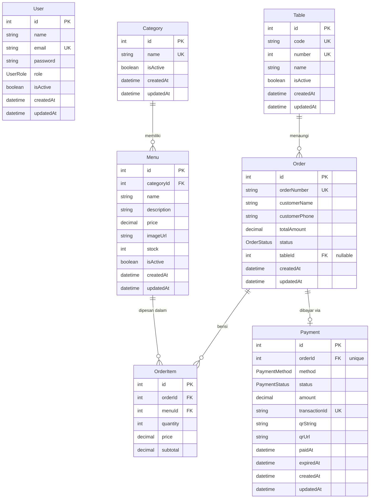

# Database

Database memakai **PostgreSQL** dengan **Prisma ORM 7** (`@prisma/adapter-pg` sebagai driver adapter). Skema sumber ada di [`prisma/schema.prisma`](../prisma/schema.prisma).

## Entity Relationship Diagram



> Catatan: `User` belum punya relasi langsung ke `Order` di skema saat ini — data pemesan disimpan sebagai `customerName` / `customerPhone` bebas di tabel `Order`, bukan foreign key ke `User`.

## Model

### `User`

| Field | Tipe | Keterangan |
| ----- | ---- | ---------- |
| `id` | `Int` (PK, autoincrement) | |
| `name` | `String` | |
| `email` | `String` (unique) | Dipakai sebagai identifier login |
| `password` | `String` | Hash bcrypt (10 salt rounds), **tidak pernah** dikembalikan oleh endpoint publik |
| `role` | `UserRole` (`ADMIN` \| `CUSTOMER`) | Default `CUSTOMER`. Ikut disisipkan ke payload JWT saat login, tapi belum ada guard berbasis role (`RolesGuard`) di codebase saat ini |
| `isActive` | `Boolean` | Default `true`. Belum dipakai untuk logic apa pun (mis. blokir login user nonaktif) |
| `createdAt` / `updatedAt` | `DateTime` | Auto-managed Prisma |

Lihat [features/users.md](features/users.md) dan [features/auth.md](features/auth.md).

### `Category`

| Field | Tipe | Keterangan |
| ----- | ---- | ---------- |
| `id` | `Int` (PK, autoincrement) | |
| `name` | `String` (unique) | Divalidasi unik di level service ([categories.service.ts](../src/modules/categories/categories.service.ts)) |
| `isActive` | `Boolean` | Default `true`. Kolom tersedia di skema, tapi belum diekspos lewat DTO/endpoint |
| `menus` | `Menu[]` | Relasi one-to-many ke `Menu` |

Lihat [features/categories.md](features/categories.md).

### `Menu`

| Field | Tipe | Keterangan |
| ----- | ---- | ---------- |
| `id` | `Int` (PK, autoincrement) | |
| `categoryId` | `Int` (FK → `Category.id`) | Divalidasi harus ada sebelum create/update |
| `name` | `String` | |
| `description` | `String?` | Opsional |
| `price` | `Decimal(12,2)` | Disimpan sebagai integer/decimal (mis. `25000` = Rp25.000, tanpa desimal pecahan) |
| `imageUrl` | `String?` | Opsional, divalidasi format URL |
| `stock` | `Int` | |
| `isActive` | `Boolean` | Default `true`. Tersedia di skema, belum diekspos lewat DTO/endpoint |
| `category` | `Category` | Relasi many-to-one |
| `orderItems` | `OrderItem[]` | Relasi one-to-many |

Lihat [features/menus.md](features/menus.md).

### `Order`

| Field | Tipe | Keterangan |
| ----- | ---- | ---------- |
| `id` | `Int` (PK) | |
| `orderNumber` | `String` (unique) | Nomor pesanan yang ditampilkan ke user |
| `customerName` / `customerPhone` | `String` | Data pemesan (belum terhubung ke `User`) |
| `totalAmount` | `Decimal(12,2)` | |
| `status` | `OrderStatus` | `PENDING` (default) → `CONFIRMED` → `PREPARING` → `READY` → `COMPLETED`, atau `CANCELLED` |
| `items` | `OrderItem[]` | |
| `payment` | `Payment?` | Relasi one-to-one opsional |
| `tableId` | `Int?` (FK → `Table.id`) | Opsional — meja tempat pesanan dibuat (dine-in). `null` untuk pesanan tanpa meja (mis. take-away) |
| `table` | `Table?` | Relasi many-to-one opsional ke `Table` |

Lihat [features/orders.md](features/orders.md).

> Catatan: `status` di-set otomatis ke `PENDING` saat order dibuat. Transisi status berikutnya (`CONFIRMED`, dst.) sudah didukung di repository (`updateStatus`) tetapi belum diekspos lewat endpoint.

### `OrderItem`

| Field | Tipe | Keterangan |
| ----- | ---- | ---------- |
| `id` | `Int` (PK) | |
| `orderId` | `Int` (FK → `Order.id`) | |
| `menuId` | `Int` (FK → `Menu.id`) | |
| `quantity` | `Int` | |
| `price` | `Decimal(12,2)` | Harga menu saat pesanan dibuat (snapshot, agar tidak berubah jika harga menu berubah kemudian) |
| `subtotal` | `Decimal(12,2)` | `price * quantity` |

### `Table`

Merepresentasikan meja fisik untuk pesanan dine-in. Satu meja bisa menaungi banyak `Order`.

| Field | Tipe | Keterangan |
| ----- | ---- | ---------- |
| `id` | `Int` (PK, autoincrement) | |
| `code` | `String` (unique) | Kode unik meja, di-generate otomatis oleh server (tidak pernah input manual) — dirancang untuk di-encode sebagai QR code di meja. Lihat [features/tables.md](features/tables.md#business-rules) |
| `number` | `Int` (unique) | Nomor meja untuk staff; wajib unik. Bila tidak dikirim saat create, di-auto-increment oleh server |
| `name` | `String` | Nama/label meja (mis. `"Meja 1"`, `"VIP 2"`) |
| `isActive` | `Boolean` | Default `true`. Kolom tersedia di skema, belum diekspos lewat DTO/endpoint |
| `orders` | `Order[]` | Relasi one-to-many ke `Order` |
| `createdAt` / `updatedAt` | `DateTime` | Auto-managed Prisma |

Lihat [features/tables.md](features/tables.md).

> Relasi `Order.tableId` bersifat opsional (`ON DELETE SET NULL`), jadi order tetap bisa dibuat tanpa mengisi meja (mis. order lewat scan QR menu umum, bukan QR yang menempel di meja tertentu).

### `Payment` *(skema siap, endpoint belum dibuat)*

| Field | Tipe | Keterangan |
| ----- | ---- | ---------- |
| `id` | `Int` (PK) | |
| `orderId` | `Int` (FK → `Order.id`, unique) | Satu order maksimal satu payment |
| `method` | `PaymentMethod` | Saat ini hanya `QRIS` |
| `status` | `PaymentStatus` | `PENDING` (default) → `PAID` \| `FAILED` \| `EXPIRED` \| `REFUNDED` |
| `amount` | `Decimal(12,2)` | |
| `transactionId` | `String?` (unique) | ID transaksi dari payment gateway |
| `qrString` / `qrUrl` | `String?` | Data QR code untuk pembayaran QRIS |
| `paidAt` / `expiredAt` | `DateTime?` | |

## Riwayat Skema

- **2026-08-18** — model `Product` di-rename menjadi `Menu` (tabel `Product` → `Menu`, kolom `OrderItem.productId` → `menuId`), lewat migration [`20260818120000_rename_product_to_menu`](../prisma/migrations/20260818120000_rename_product_to_menu/migration.sql). Migration ini memakai `ALTER TABLE ... RENAME` (bukan drop/create), sehingga data yang sudah ada tidak hilang.

## Enum

| Enum | Nilai |
| ---- | ----- |
| `UserRole` | `ADMIN`, `CUSTOMER` |
| `OrderStatus` | `PENDING`, `CONFIRMED`, `PREPARING`, `READY`, `COMPLETED`, `CANCELLED` |
| `PaymentStatus` | `PENDING`, `PAID`, `FAILED`, `EXPIRED`, `REFUNDED` |
| `PaymentMethod` | `QRIS` |

## Roadmap Order, Table & Payment

Module **`orders` sudah diimplementasikan** (`Controller → Service → Repository`, terdaftar di [app.module.ts](../src/app.module.ts)) — mencakup pembuatan order + order items dalam satu transaksi, perhitungan `totalAmount`, pengurangan `stock`, dan pengaitan opsional ke `Table` lewat `tableCode`. Lihat [features/orders.md](features/orders.md).

Module **`tables` sudah diimplementasikan** — CRUD meja lengkap termasuk generate `code` otomatis (untuk QR) dan auto-increment `number`. Lihat [features/tables.md](features/tables.md).

Yang **masih menjadi pengembangan berikutnya**:

- `PATCH /api/v1/orders/:id/status` — mengubah status order (`updateStatus` sudah ada di repository tetapi belum terekspos).
- Filter/pagination untuk `GET /api/v1/orders` dan `GET /api/v1/tables`.
- **Module `payments`** — model `Payment` **sudah ada di skema** tetapi **belum memiliki module NestJS** (tidak ada folder `src/modules/payments`). Rencana endpoint:
  - `POST /api/v1/orders/:id/payment` — generate QRIS payment.
  - Webhook/endpoint untuk update `PaymentStatus` dari payment gateway.
- **Endpoint generate gambar QR meja** — module `tables` saat ini hanya menyediakan `code` sebagai string; encoding jadi gambar QR (dan embed `code` ke URL frontend) belum jadi bagian API ini.

## Prisma Client

- `PrismaService` ([prisma.service.ts](../src/database/prisma.service.ts)) meng-extend `PrismaClient` bawaan generated output, menggunakan `PrismaPg` adapter dengan `connectionString: process.env.DATABASE_URL`.
- Terhubung otomatis saat module init (`onModuleInit` → `$connect()`) dan disconnect saat aplikasi shutdown (`onModuleDestroy` → `$disconnect()`).
- Output generator diarahkan ke `src/generated/prisma` (bukan default `node_modules/.prisma`) — lihat konfigurasi `generator client` di `schema.prisma`. **Jangan** mengedit file di folder ini secara manual; jalankan `npx prisma generate` setelah mengubah schema.

## Perintah Migrasi

```bash
npx prisma migrate dev      # buat & apply migrasi baru (development)
npx prisma migrate deploy   # apply migrasi tanpa prompt (production/CI)
npx prisma studio           # GUI untuk browse/edit data
npx prisma generate         # generate ulang Prisma Client
```

> ⚠️ **Koneksi untuk migrasi.** Proyek ini memakai Supabase dengan dua connection string (lihat [`.env`](../.env)):
>
> | Variable | Port | Mode | Dipakai |
> | -------- | ---- | ---- | ------- |
> | `DATABASE_URL` | `6543` | transaction pooler (PgBouncer) | Runtime NestJS ([prisma.service.ts](../src/database/prisma.service.ts) via `@prisma/adapter-pg`) |
> | `DIRECT_URL` | `5432` | session pooler / direct | **Migrasi & DDL** ([prisma.config.ts](../prisma.config.ts)) |
>
> Prisma CLI (`migrate`, `db push`, `studio`) memakai `DIRECT_URL` yang di-set di [prisma.config.ts](../prisma.config.ts). **Jangan** arahkan migrasi ke pooler transaction-mode (`6543`) — DDL, advisory lock, dan shadow database tidak bekerja lewat pooler tersebut sehingga `migrate` akan **menggantung/sangat lambat**.
