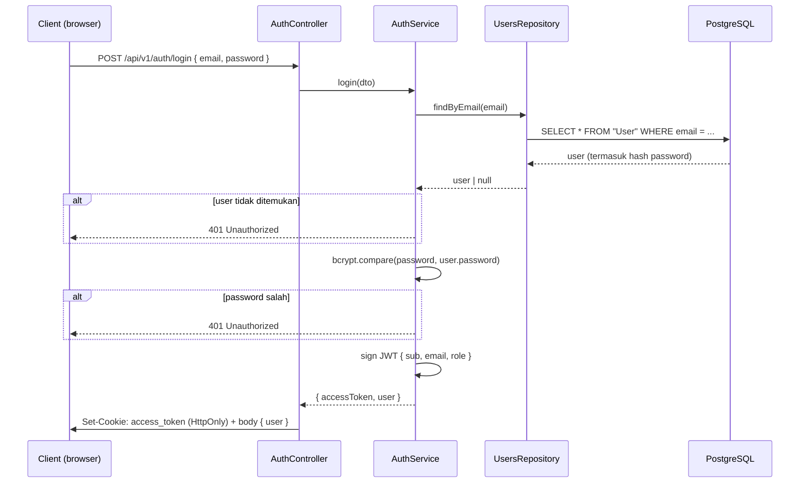

# Fitur: Autentikasi (Auth)

Module: [src/modules/auth](../../src/modules/auth)

Autentikasi memakai **JWT yang disimpan di httpOnly cookie** dengan Passport (`passport-jwt`). Token **tidak** dikembalikan di body dan **tidak** dibaca dari header `Authorization` — melainkan diset sebagai cookie `access_token` saat login dan dikirim otomatis oleh browser pada request berikutnya. Tidak ada refresh token — hanya satu access token dengan masa berlaku sesuai `JWT_EXPIRES_IN`.

> **Kenapa httpOnly cookie?** Cookie ber-flag `HttpOnly` tidak bisa dibaca JavaScript, sehingga token kebal dicuri lewat serangan XSS. Konsekuensinya, token juga tidak bisa dihapus oleh client — logout wajib lewat server (lihat [`POST /auth/logout`](#post-apiv1authlogout)).

## Alur Login



## Endpoint

### `POST /api/v1/auth/login`

Login menggunakan email & password. Bila berhasil, server **mengeset cookie `access_token`** (httpOnly) dan mengembalikan data `user` di body — **tanpa** token.

**Request body** ([LoginDto](../../src/modules/auth/dto/login.dto.ts)):

```json
{
  "email": "budi@example.com",
  "password": "secret123"
}
```

| Field      | Tipe     | Validasi                  |
| ---------- | -------- | ------------------------- |
| `email`    | `string` | wajib, format email valid |
| `password` | `string` | wajib, tidak boleh kosong |

**Response `201 Created`** — beserta header cookie:

```
Set-Cookie: access_token=eyJhbGciOiJIUzI1NiIsInR5cCI6IkpXVCJ9...; Max-Age=86400; Path=/; HttpOnly; SameSite=Lax
```

Body (payload di dalam `data`, lihat [response envelope](../architecture.md#response-envelope)) **hanya berisi `user`**:

```json
{
  "success": true,
  "data": {
    "user": {
      "id": 1,
      "name": "Budi Santoso",
      "email": "budi@example.com",
      "role": "CUSTOMER"
    }
  }
}
```

> Flag cookie diatur terpusat di [auth.cookie.ts](../../src/modules/auth/auth.cookie.ts): `httpOnly`, `sameSite: 'lax'`, `path: '/'`, `maxAge` 1 hari, dan `secure` otomatis aktif saat `NODE_ENV=production`. Di production `secure` mewajibkan HTTPS.

**Response `401 Unauthorized`** — email tidak terdaftar **atau** password salah (pesan sengaja disamakan agar tidak bocorkan email mana yang terdaftar):

```json
{
  "success": false,
  "statusCode": 401,
  "error": "Unauthorized",
  "message": "Invalid email or password",
  "path": "/api/v1/auth/login",
  "timestamp": "2026-08-14T02:00:00.000Z"
}
```

### `POST /api/v1/auth/logout`

Menghapus cookie `access_token`. Wajib lewat server karena cookie `httpOnly` tidak bisa dihapus oleh JavaScript client. Bersifat publik (tidak butuh login) dan aman dipanggil kapan saja.

**Response `201 Created`** — beserta header yang menghapus cookie:

```
Set-Cookie: access_token=; Path=/; Expires=Thu, 01 Jan 1970 00:00:00 GMT
```

```json
{
  "success": true,
  "data": { "message": "berhasil logout" }
}
```

## JWT Payload

Token berisi payload berikut (lihat `AuthService.login` di [auth.service.ts](../../src/modules/auth/auth.service.ts)):

```json
{
  "sub": 1,
  "email": "budi@example.com",
  "role": "CUSTOMER",
  "iat": 1755050400,
  "exp": 1755136800
}
```

- `sub` — user ID
- `role` — disisipkan untuk kebutuhan otorisasi berbasis role di masa depan (saat ini **belum ada** `RolesGuard`/decorator role di codebase)

## Mengakses Endpoint yang Diproteksi

Karena token ada di cookie, **browser mengirimnya otomatis** — tidak perlu menambahkan header apa pun secara manual. Dari sisi frontend, cukup pastikan request menyertakan cookie (mis. `fetch(url, { credentials: 'include' })` untuk lintas-origin).

Contoh dengan `curl` memakai cookie jar (`-c` menyimpan cookie saat login, `-b` mengirimnya):

```bash
# 1. Login → simpan cookie ke berkas
curl -c cookies.txt -X POST http://localhost:3000/api/v1/auth/login \
  -H "Content-Type: application/json" \
  -d '{"email":"budi@example.com","password":"secret123"}'

# 2. Akses endpoint terlindung → kirim cookie
curl -b cookies.txt http://localhost:3000/api/v1/users

# 3. Logout → hapus cookie
curl -b cookies.txt -X POST http://localhost:3000/api/v1/auth/logout
```

Di Swagger UI (`/docs`), skema keamanan adalah **cookie** (`access_token`). Saat login lewat Swagger di origin yang sama, browser otomatis menyimpan & mengirim cookie pada endpoint terlindung berikutnya.

## Implementasi Teknis

| File                                                                            | Peran                                                                                                                                                                                       |
| ------------------------------------------------------------------------------- | ------------------------------------------------------------------------------------------------------------------------------------------------------------------------------------------- |
| [auth.controller.ts](../../src/modules/auth/auth.controller.ts)                 | Endpoint `login` (set cookie via `res.cookie`, kembalikan `user`) & `logout` (`res.clearCookie`). Memakai `@Res({ passthrough: true })` agar cookie keset tanpa mematikan response envelope |
| [auth.service.ts](../../src/modules/auth/auth.service.ts)                       | Verifikasi kredensial (`bcrypt.compare`) & sign JWT. Tetap framework-agnostic — tidak menyentuh cookie/`Response`                                                                           |
| [auth.cookie.ts](../../src/modules/auth/auth.cookie.ts)                         | Konstanta nama cookie `ACCESS_TOKEN_COOKIE` & opsi cookie terpusat (`accessTokenCookieOptions()`)                                                                                           |
| [strategies/jwt.strategy.ts](../../src/modules/auth/strategies/jwt.strategy.ts) | Meng-extract token dari **cookie** `access_token` (`ExtractJwt.fromExtractors`), memvalidasi, dan mengubah payload menjadi `request.user = { userId, email, role }`                         |
| [guards/jwt-auth.guard.ts](../../src/modules/auth/guards/jwt-auth.guard.ts)     | Guard (`AuthGuard('jwt')`) yang dipasang manual per-route via `@UseGuards(JwtAuthGuard)`                                                                                                    |
| [dto/login.dto.ts](../../src/modules/auth/dto/login.dto.ts)                     | Validasi request body                                                                                                                                                                       |

`cookie-parser` dipasang global di [main.ts](../../src/main.ts) (`app.use(cookieParser())`) agar `req.cookies` terisi — inilah yang dibaca oleh `JwtStrategy`. CORS juga diset `credentials: true` agar cookie dapat dikirim lintas-origin.

## Catatan & Batasan Saat Ini

- **Guard bersifat opt-in per route**, bukan global route yang tidak eksplisit memasang `@UseGuards(JwtAuthGuard)` bersifat publik. Saat ini hanya `GET /api/v1/users` yang diproteksi (lihat [features/users.md](users.md)). Endpoint `categories`, `menus`, `orders`, dan `tables` (termasuk create/update/delete) **belum** diproteksi sama sekali.
- **CSRF**: autentikasi berbasis cookie memunculkan risiko CSRF. `SameSite=Lax` sudah memblokir pengiriman cookie pada request lintas-situs yang mengubah state (POST/PATCH/DELETE), memberi proteksi baseline. Jika nanti frontend berbeda domain (`SameSite=None`), perlu ditambahkan proteksi CSRF token.
- **`login`/`logout` membalas `201 Created`** (perilaku default `@Post`). Secara makna lebih pas `200 OK` — bisa dirapikan dengan `@HttpCode(200)`.
- Tidak ada refresh token; saat token expired (`Max-Age` habis), user harus login ulang.
- `JwtStrategy` akan melempar error saat aplikasi start jika `JWT_SECRET` tidak diset (fail-fast), lihat [getting-started.md](../getting-started.md#troubleshooting).
